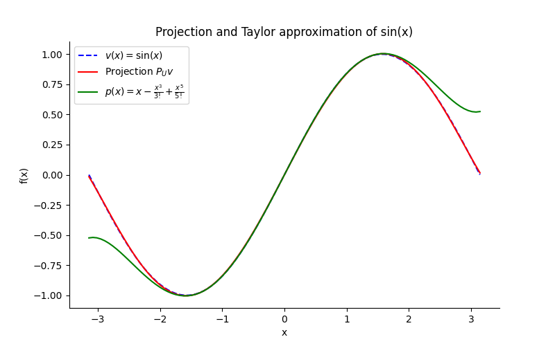
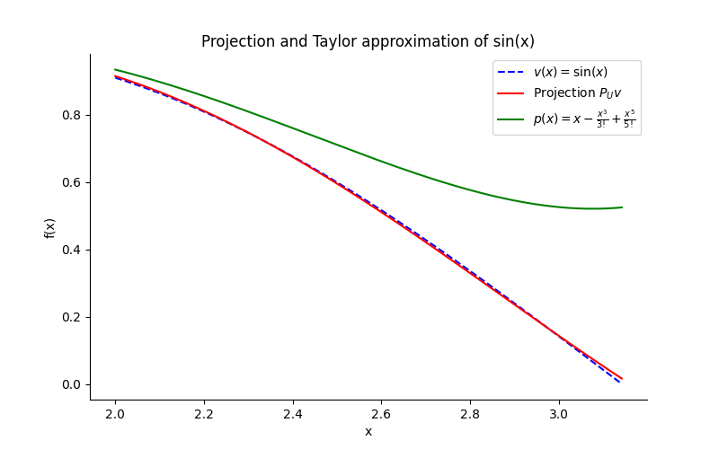
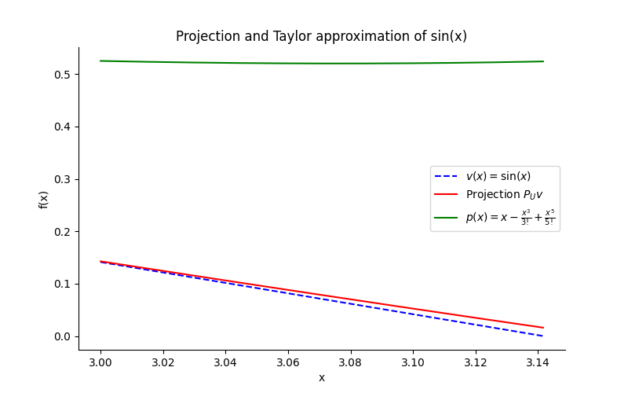

# Approximation of $\sin x$ on $[-\pi, \pi]$ by orthogonal projection

Example 6.63 from Axler's [Linear Algebra Done
Right](https://linear.axler.net/)  🙏

**Goal**: compute an approximation to the sine function that improves upon the
Taylor Polynomial approximation from calculus.

- Let $C[-\pi, \pi]$ denote the real inner product space of continuous
    real-valued functions on $[-\pi, \pi]$ with inner product $\langle f, g
    \rangle = \int_{-\pi}^{\pi} fg$.
- Let $v \in C[-\pi, \pi]$ be the function $v(x) = \sin x$
- Let $U$ denote the subspace $\mathcal{P}_{5}(\mathbb{R}) \subseteq C[-\pi,
    \pi]$ (the space of polynomials of degree at most $5$ with real
    coefficients)
- The goal is to choose $u \in U$ such that $\Vert v - u \Vert$ is as
  small as possible where

$$
\begin{aligned}
\Vert v - u \Vert = \int_{-\pi}^{\pi} \vert \sin x - u(x) \vert^{2} dx.
\end{aligned}
$$

- The solution is given by the orthogonal projection of $v(x) =
    \sin x$ onto $U = \mathcal{P}_{5}(\mathbb{R})$

**Approach**:

- Have standard basis of $\mathcal{P}_{5}(\mathbb{R})$

$$
\begin{aligned}
(v_{1}, v_{2}, v_{3}, v_{4}, v_{5}, v_{6})
= (1, x, x^{2}, x^{3}, x^{4}, x^{5}).
\end{aligned}
$$

- Compute orthonormal basis of $\mathcal{P}_{5}(\mathbb{R})$ by applying the
  Gram-Schmidt procedure to the basis above.
- The $k$th vector of the orthonormal basis is computed as:

$$
\begin{aligned}
  f_{k} &= v_{k} -
  \frac{\langle v_{k}, f_{1} \rangle}{\Vert f_{1} \Vert^{2}} f_{1} - \cdots - \frac{\langle v_{k}, f_{k - 1} \rangle}{\Vert f_{k - 1} \Vert^{2}} f_{k - 1} \\
  e_{k} &= \frac{f_{k}}{\Vert f_{k} \Vert}.
\end{aligned}
$$

- Compute the orthogonal projection of $v(x) = \sin x$ onto
        $\mathcal{P}_{5}(\mathbb{R})$ by using the orthonormal basis found above
        and the formula:

$$
\begin{aligned}
         P_{U}v = \langle v, e_{1} \rangle e_{1}
         + \cdots + \langle v, e_{m} \rangle e_{m}.
\end{aligned}
$$

## Installation

- Install with

```bash
uv venv
uv pip install .
```

## Results

See [code](gs_poly_project.py).

```bash
❯ python gs_poly_project.py
Creating orthonormal basis...
Projecting sin(x) onto orthonormal basis...
Projection: 0.00564311797634678*x**5 - 0.155271410633428*x**3 + 0.987862135574673*x
Largest relative error for x ∈ [3, π]: (x=3.0, error= 271.11)
```

The orthogonal projection (function) is given by (approximately):

$$
\begin{aligned}
u(x) = 0.987862135574673 \cdot x - 0.155271410633428 \cdot x^{3} - 0.00564311797634678 \cdot x^{5}
\end{aligned}
$$

The exact solution (see sympy output) equals:

$$
\begin{aligned}
   & P_U v =
  \frac{3 x}{\pi^{2}} + \frac{5 \sqrt{14} \left(x^{3} - \frac{3 \pi^{2}
      x}{5}\right) \left(- \frac{5 \sqrt{14} \left(- \frac{2 \pi^{3}}{5} + 6
      \pi\right)}{4 \pi^{\frac{7}{2}}} + \frac{5 \sqrt{14} \left(- 6 \pi + \frac{2
        \pi^{3}}{5}\right)}{4 \pi^{\frac{7}{2}}}\right)}{4 \pi^{\frac{7}{2}}}
  \\
   & +
  \frac{63 \sqrt{22} \left(- \frac{63 \sqrt{22} \left(- 120 \pi - \frac{8
        \pi^{5}}{63} + \frac{40 \pi^{3}}{3}\right)}{16 \pi^{\frac{11}{2}}} + \frac{63
      \sqrt{22} \left(- \frac{40 \pi^{3}}{3} + \frac{8 \pi^{5}}{63} + 120
      \pi\right)}{16 \pi^{\frac{11}{2}}}\right) \left(x^{5} - \frac{3 \pi^{4} x}{7} -
    \frac{10 \pi^{2} \left(x^{3} - \frac{3 \pi^{2} x}{5}\right)}{9}\right)}{16
    \pi^{\frac{11}{2}}}
\end{aligned}
$$

### Plots

Sine function, orthogonal projection and Taylor and approximation on $[-\pi,
\pi]$


Sine function, orthogonal projection and Taylor and approximation on $[2, \pi]$


Sine function, orthogonal projection and Taylor and approximation on $[3, \pi]$

